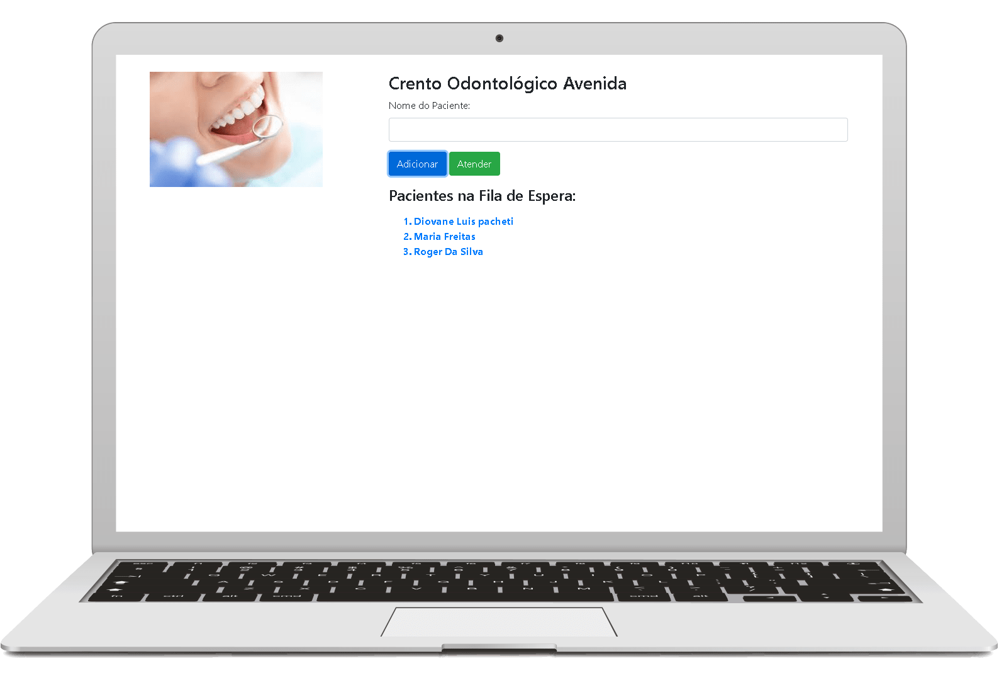

<h1 align="center">Centro Odontológico Avenida</h1>

<p align="center">
    
</p>



- [deploy na Vercel](https://centro-odontologico-avenida.vercel.app/)


## Tecnologias Utilizadas no projeto :construction:

- [Node.js](https://nodejs.org/en/) 
- [ReactJS](https://pt-br.reactjs.org/) 


## Projeto :computer:

Este projeto e uma pagina que lista uma ordem de pacientes de uma clinica ha ser atendido 

> - create-react-app
>
> ```npx create-react-app ```

## Como executar :gear:

- Clone o repositório `https://github.com/DioenDJS/Centro_odontologico_Avenida.git`.
- Install as dependências com o comando `npm install`.
- Rode o `npm start` para iniciar a aplicação.<br />
Ao final a aplicação estará disponível em `http://localhost:3000`.


## Bootstrap utilizado no projeto :page_with_curl:

- [Bootstrap](https://maxcdn.bootstrapcdn.com/bootstrap/4.5.2/css/bootstrap.min.css)

inserir no head do index.html no diretório public
```
<link rel="stylesheet" href="https://maxcdn.bootstrapcdn.com/bootstrap/4.5.2/css/bootstrap.min.css">
```


## Aprendizado:
> - Manupulação de variaveis com o useState() para alterarmos os valores(estados de variaveis) e como utilizamos para manipular campos de formulários.